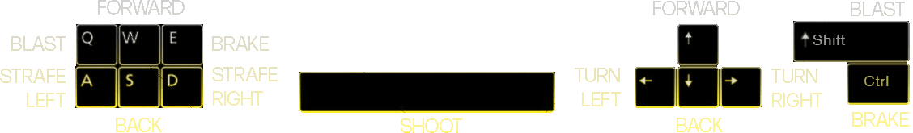
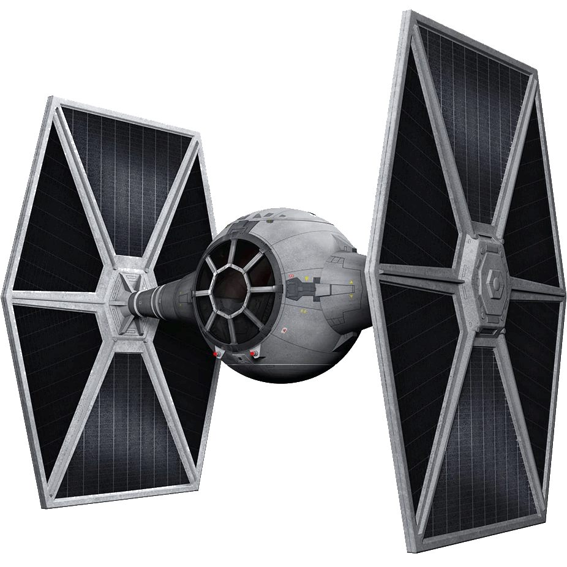
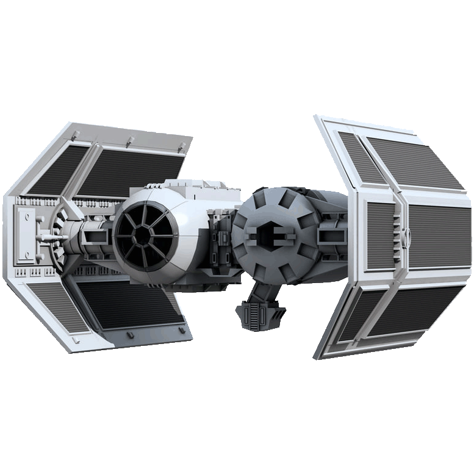
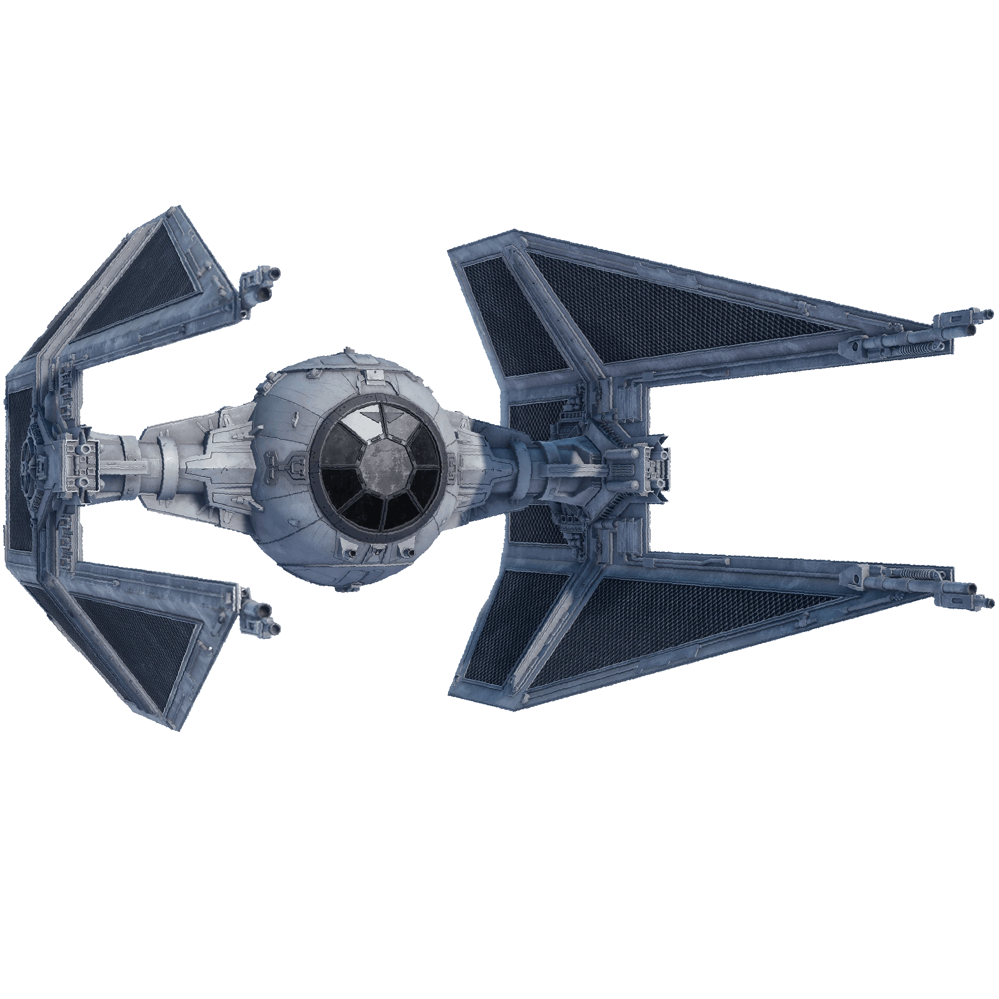
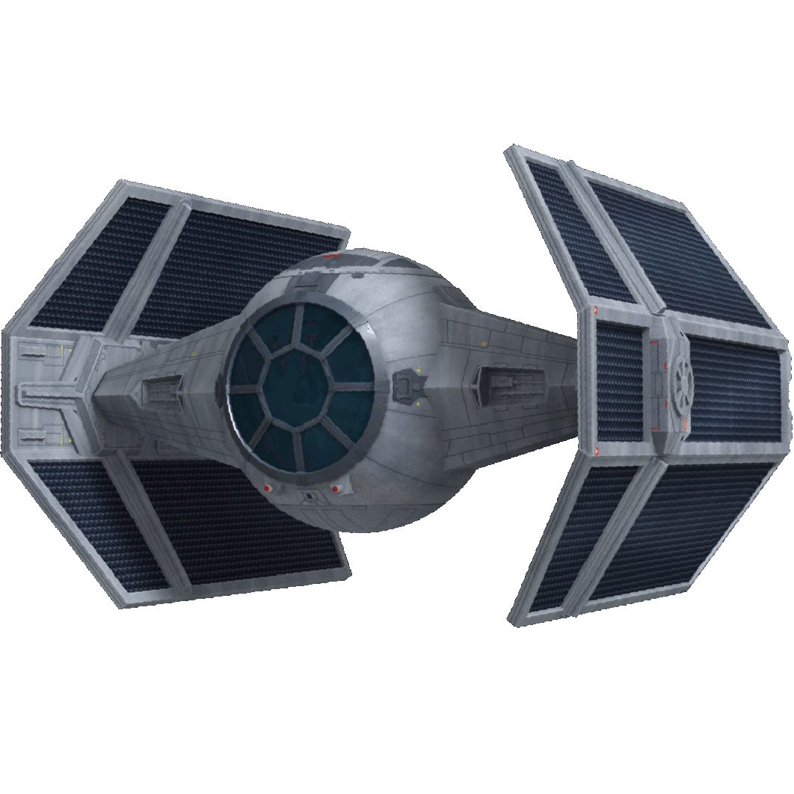
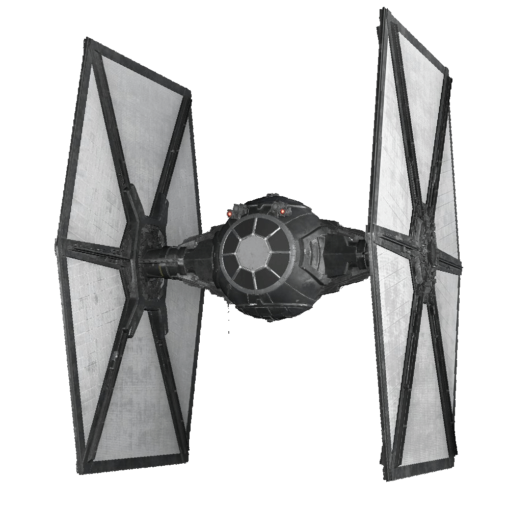

# ChuckSTARoids v5

🚀 **Download**: [Latest Release](https://github.com/justchuckofficial/ChuckSTARoids/releases/latest)

**Available Downloads:**
- **Windows**: `ChuckSTARoids_v5.exe`
- **macOS**: `ChuckSTARoids_v5.dmg` (coming soon)

---

## 🎮 Controls

---

## Asteroid Points (Based on Size)
| Size | Points |
|------|--------|
| 1 (XXS) | 11 |
| 2 (XXS) | 22 |
| 3 (XS) | 33 |
| 4 (S) | 44 |
| 5 (M) | 55 |
| 6 (L) | 66 |
| 7 (XL) | 77 |
| 8 (XXL) | 88 |
| 9 (XXXL) | 99 |

---

## Enemy Points
    

- **UFO Shot**: 500 points
- **UFO Collision**: 200-250 points

---

## 🏆 Milestone Rewards
- **25,000 points** → Shield recharge
- **100,000 points** → Shield + ability recharge
- **250,000 points** → Extra life + full recharges

---

## 🚀 Quick Start

1. **Download** the executable for your platform
2. **Run** the game (no installation needed)
3. **Use arrow keys** to move and spacebar to shoot
4. **Build multipliers** by chaining kills
5. **Survive** as long as possible!
