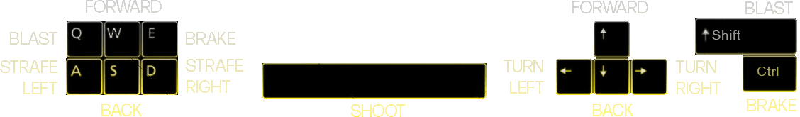
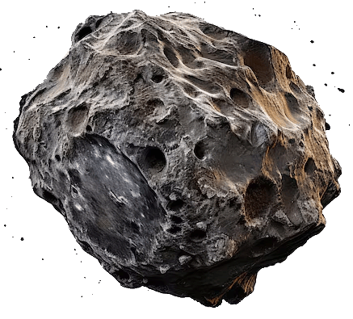
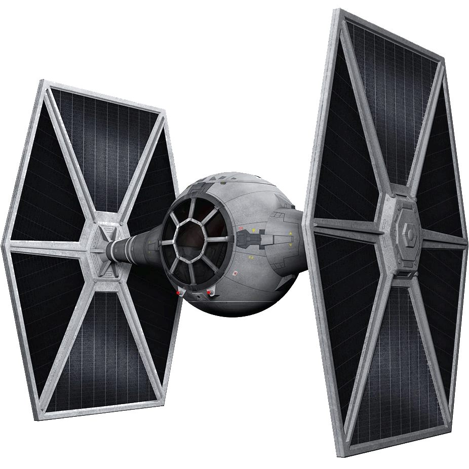
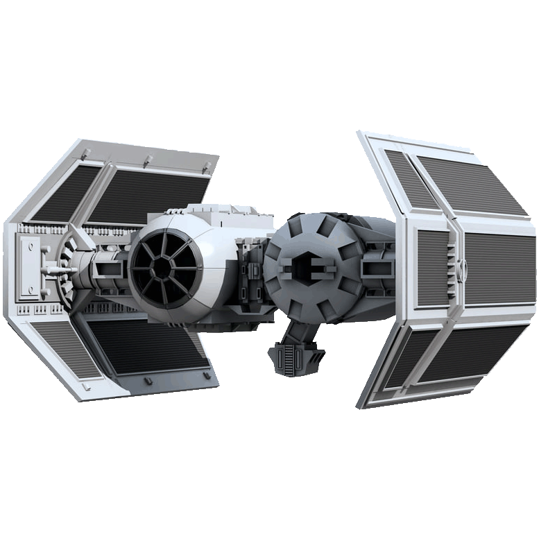
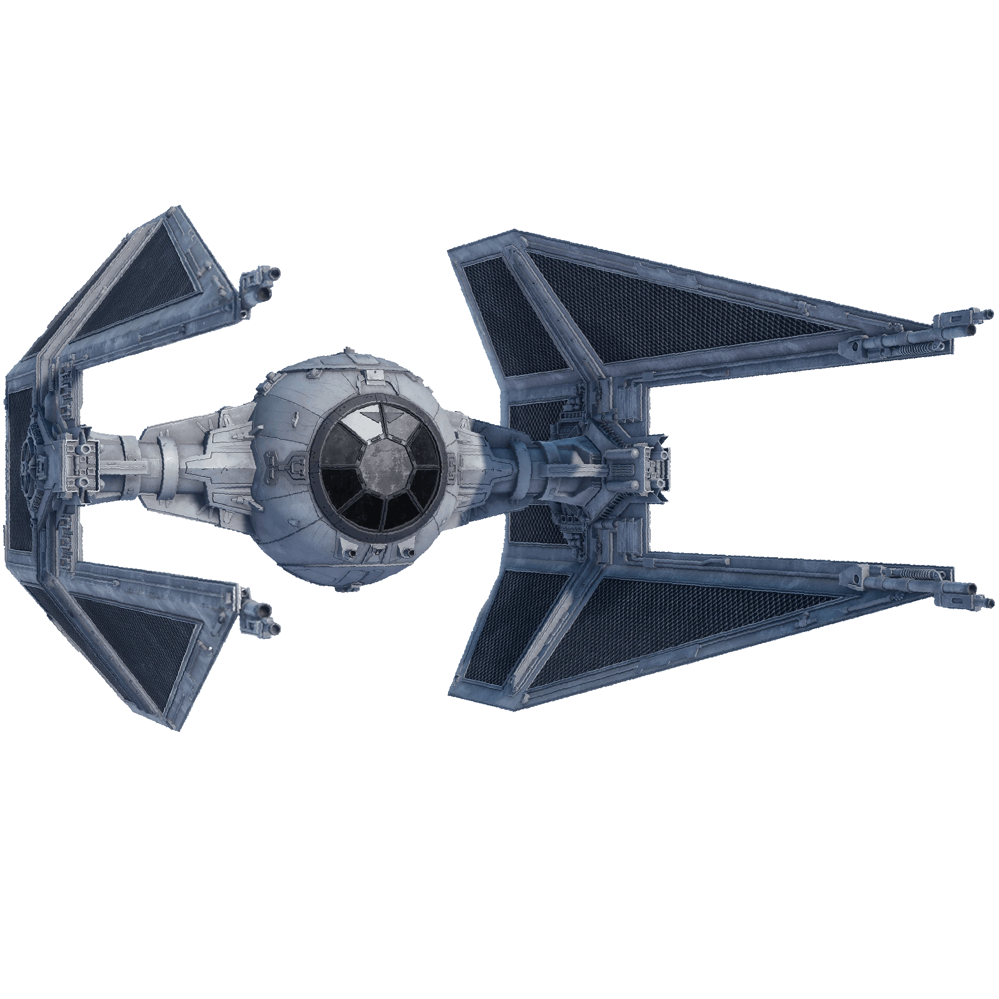
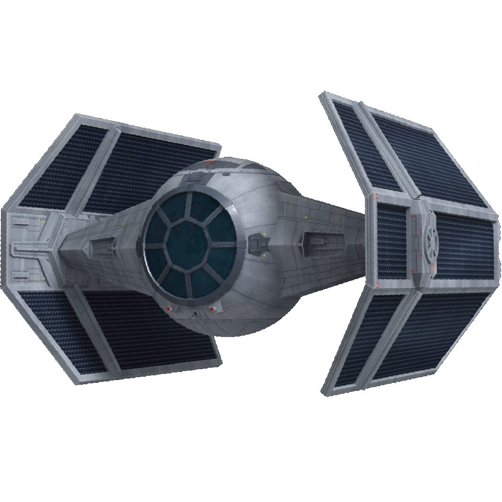
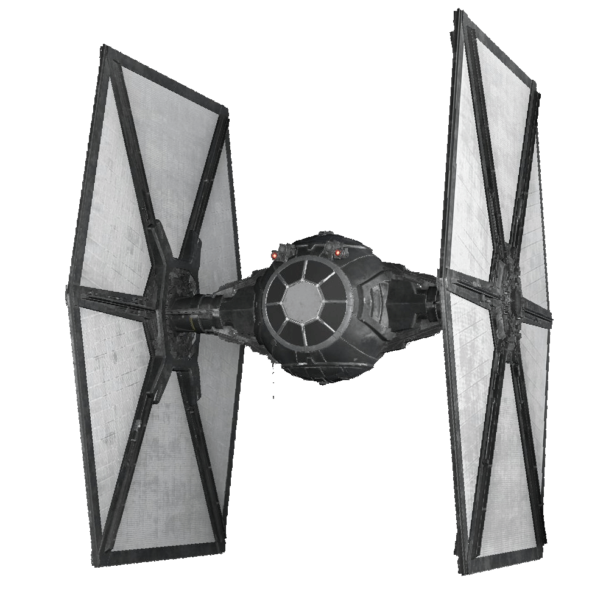

# ChuckSTARoids v5

🚀 **Download**: [Windows](https://github.com/justchuckofficial/ChuckSTARoids_v5/actions) | [macOS](https://github.com/justchuckofficial/ChuckSTARoids_v5/actions)

---

## 🎮 Controls

---

## Asteroid Points (Based on Size)

  

    <table>
      <tr><th>Size</th><th>Points</th></tr>
      <tr><td>1 (XXS)</td><td>11</td></tr>
      <tr><td>2 (XXS)</td><td>22</td></tr>
      <tr><td>3 (XS)</td><td>33</td></tr>
      <tr><td>4 (S)</td><td>44</td></tr>
      <tr><td>5 (M)</td><td>55</td></tr>
      <tr><td>6 (L)</td><td>66</td></tr>
      <tr><td>7 (XL)</td><td>77</td></tr>
      <tr><td>8 (XXL)</td><td>88</td></tr>
      <tr><td>9 (XXXL)</td><td>99</td></tr>
    </table>
  

  

    
  

---

## Enemy Points
    

- **UFO Shot**: 500 points
- **UFO Collision**: 200-250 points

---

## 🏆 Milestone Rewards
- **25,000 points** → Shield recharge
- **100,000 points** → Shield + ability recharge
- **250,000 points** → Extra life + full recharges
- **Every 250k** → Additional life (max 5 lives)

---

## 🚀 Quick Start

1. **Download** the executable for your platform
2. **Run** the game (no installation needed)
3. **Use arrow keys** to move and spacebar to shoot
4. **Build multipliers** by chaining kills
5. **Survive** as long as possible!

**System Requirements**: Windows 10+ or macOS 10.13+